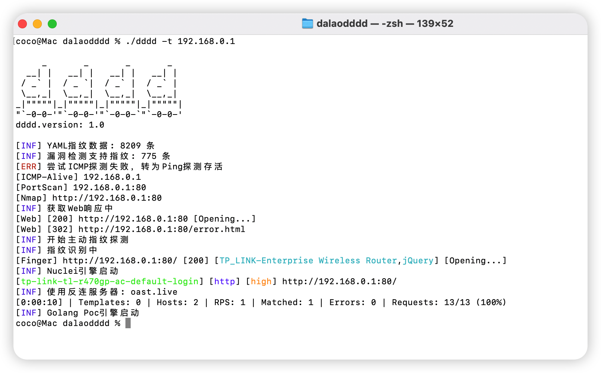
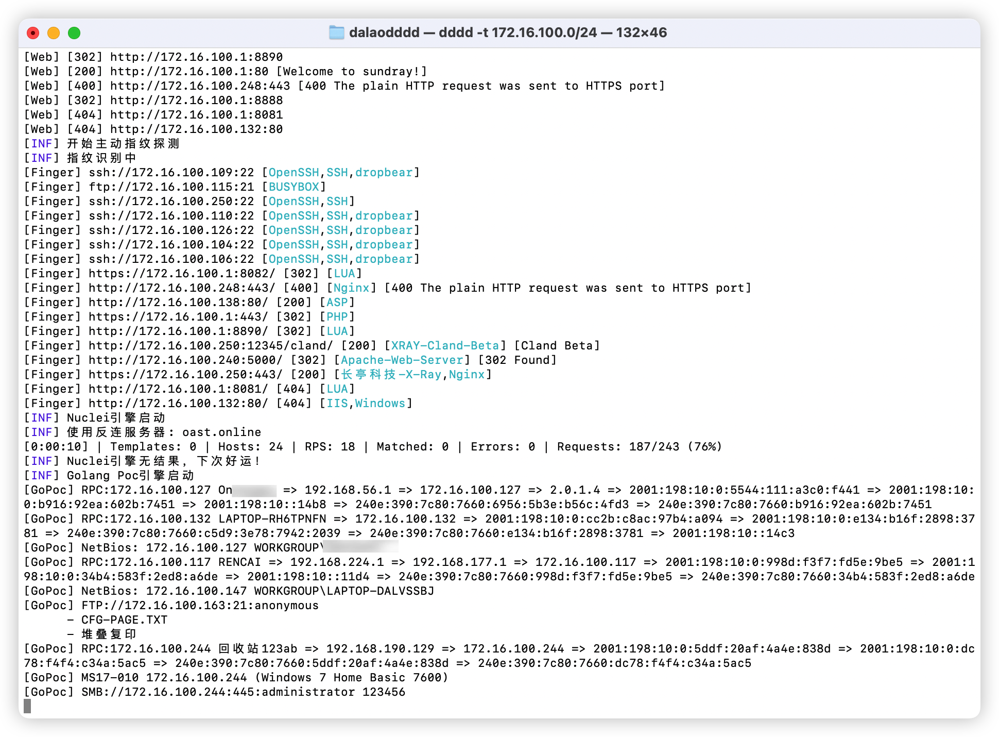
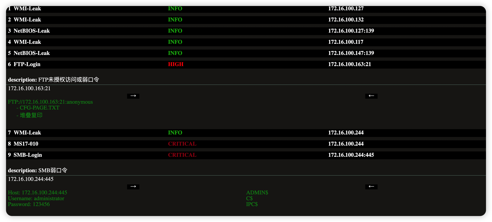
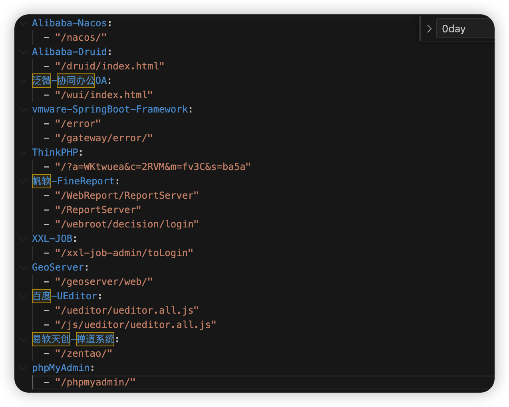
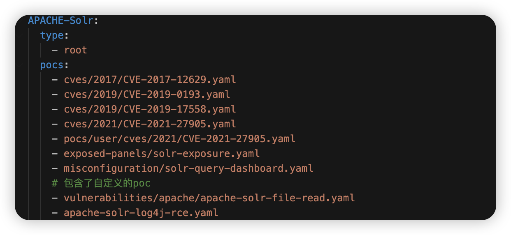

# 工具简介

dddd（带带弟弟），是一款支持多种输入格式，主/被动指纹识别且使用简单的供应链漏洞探测工具。协助红队人员快速收集信息，测绘目标资产，寻找薄弱点。支持从Hunter、Fofa批量拉取目标。


##### 本工具有如下特点:

1. 自动识别多种输入。支持域名、IP段、IP、URL、IP:Port、Domain:Port等多种格式。得到目标之后直接一股脑塞入即可，**无需分类**。
2. 指纹识别采用人类阅读友好的类FOFA语法(支持任意与或非与括号组合)。并且拥有主动探测路径库，便于探测如nacos,druid等需要主动访问的资产。
3. 拥有指纹漏洞库，**只针对识别出指纹的目标打对应的Poc**。尽量避免无效识别，极大提升扫描速度，同时降低误报率。
4. 支持多种方式枚举子域名。子域名暴力破解,fofa,chaos,chinaz,hunter,quake,virustotal等。
5. 具有TCP指纹识别功能，避免错过非标准端口漏洞。如可正确识别33060端口的Mysql。
6. 可直接从Hunter中批量获取目标资产。如icp.name="xxxx"，批量获取此单位备案资产，方便攻防演练快速筛选目标（快速占坑）。
7. 漏洞探测基于**nuclei**，与nuclei社区的强大抛瓦贴贴。
8. HTML报表，包含漏洞请求与响应。方便漏洞验证、截图。


# 主要功能

#### 信息收集

CDN识别

子域名枚举

ICMP/Ping存活探测

端口扫描

Hunter/Fofa导入资产

域名绑定资产枚举

#### 指纹识别

TCP Banner指纹识别

Web指纹识别

#### 漏洞探测

Nuclei Poc

Golang Poc

#### 其他功能

txt日志记录

HTML漏洞报表


# 使用说明
下载config目录或从releases中下载config.zip解压，与对应的dddd二进制文件。保存在一个目录下，打开终端，照着下边输入命令就可以愉快玩耍啦~


### 简单用法

##### 从IP开始扫描

```shell
# 当IP Ping通后扫描Top1000端口
./dddd -t 192.168.0.1
# 当IP Ping通后全端口扫描
./dddd -t 172.16.100.1 -p 1-65535
# 指定IP禁Ping全端口扫描指定端口
./dddd -t 172.16.100.1 -p 80,53,1433-5000 -Pn
# 调用Masscan进行全端口SYN扫描(需安装Masscan)
./dddd -t 192.168.0.0/16 -p 1-65535 -Pn -st syn
```


##### 从IP段开始扫描

```shell
./dddd -t 172.16.100.0/24
./dddd -t 192.168.0.0-192.168.0.12
```


##### 从端口开始扫描

```shell
./dddd -t 192.168.44.12:80
```


##### 从Web开始扫描

```shell
./dddd -t http://test.com
```


##### 从域名开始扫描

探测(子)域名是否使用了CDN，若解析出真实IP则进入IP扫描

```shell
# 不枚举test.com子域名，只识别test.com
./dddd -t test.com
# 枚举子域名，识别所有获取到的子域名是否为CDN资产
./dddd -t test.com -sd
```


##### 从Hunter开始扫描

先配置./config/subfinder-config.yaml中的Hunter API。

```yaml
hunter: ["ffxxxxxxxxxxxxxxxxxxxxxxxxxxxxxxxxxxxxxxxxxxxxxxxxxxxxxxxxxxxxxx"]
```

配置完成后打开命令行

```shell
# 从Hunter中获取备案机构为 带带弟弟 的目标进入扫描 默认最大1000条
./dddd -t '"icp.name="带带弟弟"' -hunter
# 最大查询1页，一页100个。避免积分过度消耗
./dddd -t '"icp.name="带带弟弟"' -hunter -htpc 1
```

攻防演练中通过Hunter导入企业备案资产方便快速占坑。


##### 从Fofa开始扫描

先配置./config/subfinder-config.yaml中的FOFA 邮箱和KEY。

```yaml
fofa: ["xxxx@qq.com:xxxxxxxxxxxxxxxxxxxxxxxxxxxxxxxx"]
```

配置完成后打开命令行

```shell
./dddd -t "domain=\"baidu.com\"" -fofa (从fofa取100个baidu.com域名的目标)
./dddd -t "domain=\"baidu.com\"" -fofa -ffmc 10000 (指定最大数量为10000 默认100)
```


##### 多目标扫描

在target.txt中写入你的目标，如

```
172.16.100.0/24
192.168.0.0-192.168.255.255
http://test.com
aaa.test.com
10.12.14.88:9999
```

然后在命令行中敲下如下命令。dddd会自动识别资产类型并送入对应流程。

```
./dddd -t target.txt
```


当然dddd也支持多Hunter、Fofa语句，如在target.txt写下

```
ip="111.111.111.222"
domain="bbbb.cc"
icp.name="带带弟弟"
```

然后在命令行中敲下如下命令。dddd会批量从Hunter查询资产并送入对应流程。

```
./dddd -t target.txt -hunter
```


##### 说明

默认漏洞输出结果文件名为  时间戳.html

日志保存在 log.txt


扫描可以随时停止，当有指纹识别、漏扫结果输出时，会实时保存在文件内。 


### 详细参数

```shell
coco@Mac dalaodddd % ./dddd -h

     _       _       _       _   
  __| |   __| |   __| |   __| |  
 / _` |  / _ `|  / _` |  / _` |  
 \__,_|  \__,_|  \__,_|  \__,_|  
_|"""""|_|"""""|_|"""""|_|"""""| 
"`-0-0-'"`-0-0-'"`-0-0-`"`-0-0-'
dddd.version: 1.1

Usage of ./dddd:
  -Pn
    	禁用主机发现功能(icmp,arp)
  -ffmc int
    	Fofa 查询资产条数 Max:10000 (default 100)
  -fofa
    	从Fofa中获取资产,开启此选项后-t参数变更为需要在fofa中搜索的关键词
  -gopt int
    	GoPoc运行线程 (default 50)
  -htpc int
    	Hunter 最大查询页数 (default 10)
  -htps int
    	Hunter 每页资产条数 (default 100)
  -hunter
    	从hunter中获取资产,开启此选项后-t参数变更为需要在hunter中搜索的关键词
  -ld
    	允许域名解析到局域网
  -mp string
    	指定masscan路径 (default "masscan")
  -nd
    	关闭主动指纹探测
  -ngp
    	关闭Golang Poc探测
  -nsbf
    	关闭子域名爆破
  -nsf
    	关闭被动子域名枚举
  -o string
    	html格式输出报告
  -p string
    	目标IP扫描的端口。 默认扫描Top1000
  -pc int
    	一个IP的端口数量阈值,当一个端口的IP数量超过此数量，此IP将会被抛弃 (default 300)
  -proxy string
    	HTTP代理，在外网可利用云函数/代理池的多出口特性恶心防守 例: http://127.0.0.1:8080
  -psto int
    	TCP扫描超时时间(秒) (default 6)
  -rod string
    	Set the default value of options used by rod.
  -sbft int
    	爆破子域名协程数量 (default 150)
  -sd
    	开启子域名枚举
  -st string
    	端口扫描方式 tcp使用TCP扫描(慢),syn为调用masscan进行扫描(需要masscan依赖) (default "tcp")
  -synt int
    	SYN扫描线程(masscan) (default 10000)
  -t string
    	被扫描的目标。 192.168.0.1 192.168.0.0/16 192.168.0.1:80 baidu.com:80 target.txt
  -tc int
    	TCP全连接获取Banner的线程数量 (default 30)
  -tcpt int
    	TCP扫描线程 (default 600)
  -wt int
    	Web探针线程,根据网络环境调整 (default 100)
  -wto int
    	Web探针超时时间,根据网络环境调整 (default 12)

```


# 运行截图

### 命令行界面



支持探测中文主机名，修复fscan乱码




### 漏洞报表

直观的漏洞报表

请求/响应包留存


数据库基础信息留存，方便漏洞验证/截图


SMB列共享目录





# 配置

### 指纹

指纹数据库存于 ./config/finger.yaml

支持的指纹基础规则如下

```shell
header="123" //返回头中包含123
header!="123" //返回头中不包含123
header~="xxx" //返回头满足xxx正则
body="123" //body中包含123
body!="123" //body中不包含123
body~="xxx" //body满足xxx正则
body=="123" //body为123
server="Sundray" //返回头server字段中包含Sundray
server!="Sundray" //返回头server字段中不包含Sundray
server=="Sundray" //server字段为Sundray
title="123" //标题包含123
title!="123" //标题不包含123
title=="123" //标题为123
title~="xxx" //标题满足xxx正则
cert="123" //证书中包含123
cert!="123" //证书中不包含123
cert~="xxx" //证书满足正则
port="80" //服务端口为80
port!="80" //服务端口不为80
port>="80" //服务端口大于等于80
port<="80" //服务端口小于等于80
protocol="mysql" //协议为mysql
protocol!="mysql" //协议不为mysql
path="123/123.html" //爬虫结果中包含 123/123.html
body_hash="619335048" //响应体mmh3 hash为619335048
icon_hash="619335048"  //icon mmh3 hash
status="200" //页面返回码为200
status!="200" //页面返回码不为200
content_type="text/html" //content_type包含text/html
content_type!="text/html" //content_type不包含text/html
banner="123" // TCP banner 包含123
banner!="123" // TCP banner中不含123
```

各类规则支持与(&&)或(||)非(!)任意组合。可使用括号。与fofa搜索语法类似。


这里拿Fortinet-sslvpn举例。

需要Web响应体中包含fgt_lang，编写规则body="fgt_lang"

需要Web响应体中包含/sslvpn/portal.html，编写规则body="/sslvpn/portal.html"

需要同时满足这两个条件才会被判定为Fortinet-sslvpn的资产，将两个规则使用与(&&)连接就得到了这条指纹。


### API

若有被动枚举子域名、请求fofa、hunter等需求。请在./config/subfinder-config.yaml中配置API。


### 子域名字典

子域名字典位于./config/subdomains.txt


### 服务爆破字典

字典路径为./config/dict/

每行以"空格:空格"分割账号密码

```
root : 123456
root : admin
root : admin123
```

其中shirokeys.txt为shiro key字典


### 主动指纹

当一个应用不暴露在根路径时就需要主动去访问，这个时候需要配置主动指纹数据库。

路径在./config/dir.yaml



配置也很简单，照着上边写就行。

这里拿Alibaba-Nacos举例子。当访问到http://host:port/nacos/，且访问后识别到Alibaba-Nacos指纹后就被判断有效。


### 漏洞Poc编写

编写参考nuclei poc编写

https://nuclei.projectdiscovery.io/templating-guide/


Poc存放路径

./config/pocs


将poc写好后放入./config/pocs即可识别。


### 工作流

仅仅编写Poc并放入./config/pocs是不会正常运行Poc的。需要为此Poc配置指定的指纹，本工具只有在匹配到目标指纹后才会调用这个Poc。


工作流存放目录

./config/workflow.yaml




以solr为例。

当dddd识别到目标指纹为APACHE-Solr时，就会在./config/pocs中寻找路径以

cves/2017/CVE-2017-12629.yaml

....

apache-solr-log4j-rce.yaml

结尾的poc调用。


如果我写好一个名为solr-rce.yaml的nuclei poc，则应该在workflow.yaml的对应指纹的pocs下添加一行solr-rce.yaml。这样才能在识别到solr时调用到此poc。


type是拿来干什么的呢？

比如这里有一个nacos，他的路径是http://host:port/aaa/bbb/nacos/a.js

如果有root标签，他会在 http://host:port/处打一次poc

如果有dir标签，在

http://host:port/aaa/

http://host:port/aaa/bbb/ (命中)

http://host:port/aaa/bbb/nacos/

下各打一次poc

如果有base标签，在http://host:port/aaa/bbb/nacos/a.js下打一次poc

一般情况下，root就能用，若应用部署在二级目录下，但poc是一级目录的poc，就需要dir参数才能探测到二级目录下的洞。


# GoPoc

当前支持的GoPoc列表

```
FTP
MSSQL
MYSQL
ORACLE
POSTGRESQL
RDP
REDIS
SMB
SSH
TELNET
Shiro Key
MONGODB
MEMCACHED
MS17-010
JDWP RCE
```


# 免责声明

本工具仅面向**合法授权**的企业安全建设行为，如您需要测试本工具的可用性，请自行搭建靶机环境。

在使用本工具进行检测时，您应确保该行为符合当地的法律法规，并且已经取得了足够的授权。**请勿对非授权目标进行扫描。**

如您在使用本工具的过程中存在任何非法行为，您需自行承担相应后果，我们将不承担任何法律及连带责任。

在安装并使用本工具前，请您**务必审慎阅读、充分理解各条款内容**，限制、免责条款或者其他涉及您重大权益的条款可能会以加粗、加下划线等形式提示您重点注意。 除非您已充分阅读、完全理解并接受本协议所有条款，否则，请您不要安装并使用本工具。您的使用行为或者您以其他任何明示或者默示方式表示接受本协议的，即视为您已阅读并同意本协议的约束。


# 更新历史

2023HVV 漏洞正在更新

[更新历史](Update.md)


# 贡献者

h0nayuzu


# 参考链接

https://github.com/shadow1ng/fscan

https://github.com/lcvvvv/kscan

https://github.com/lcvvvv/gonmap

https://github.com/projectdiscovery/nuclei

https://github.com/projectdiscovery/subfinder

https://github.com/projectdiscovery/httpx

https://github.com/projectdiscovery/naabu

https://github.com/chainreactors/gogo

https://github.com/zan8in/afrog


## Star History Chart

[](https://star-history.com/#SleepingBag945/dddd&Date)


