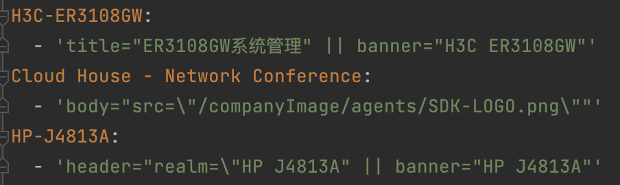
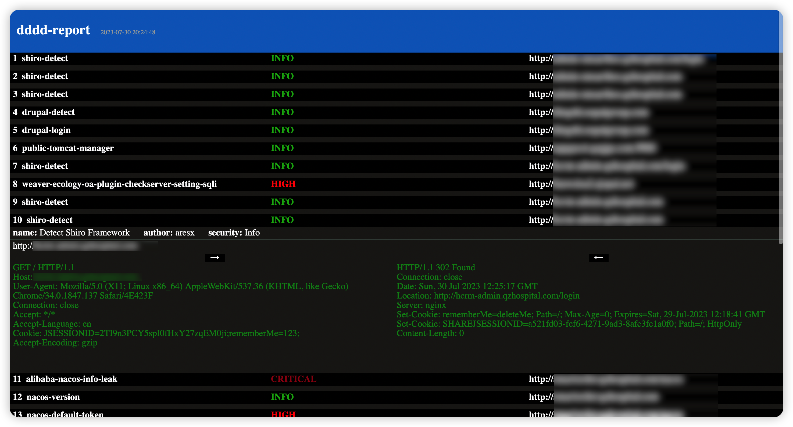
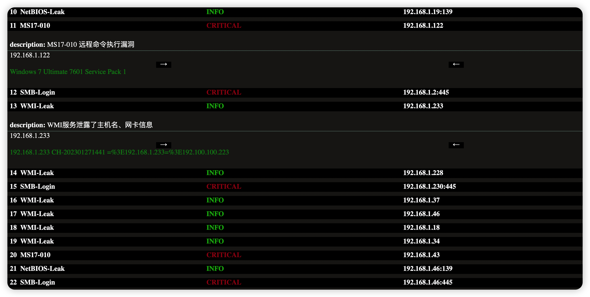
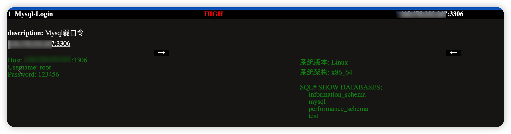
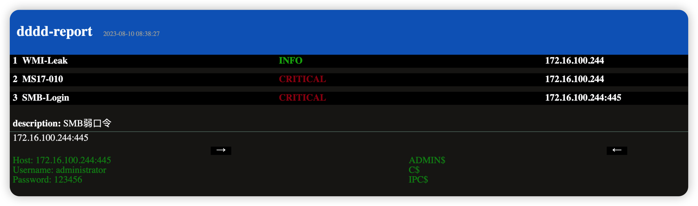

# 常见用法

##### 从IP开始扫描

```shell
# 当IP Ping通后扫描Top1000端口
./dddd -t 192.168.0.1
# 当IP Ping通后全端口扫描
./dddd -t 172.16.100.1 -p 1-65535
# 指定IP禁Ping全端口扫描指定端口
./dddd -t 172.16.100.1 -p 80,53,1433-5000 -Pn
# 调用Masscan进行全端口SYN扫描(需安装Masscan)
./dddd -t 192.168.0.0/16 -p 1-65535 -Pn -st syn
```

##### 从IP段开始扫描

```shell
./dddd -t 172.16.100.0/24
./dddd -t 192.168.0.0-192.168.0.12
```

##### 从端口开始扫描

```shell
./dddd -t 192.168.44.12:80
```

##### 从Web开始扫描

```shell
./dddd -t http://test.com
```

##### 从域名开始扫描

探测(子)域名是否使用了CDN，若解析出真实IP则进入IP扫描

```shell
# 不枚举test.com子域名，只识别test.com
./dddd -t test.com
# 枚举子域名，识别所有获取到的子域名是否为CDN资产
./dddd -t test.com -sd
```

##### 从Hunter开始扫描

先运行`./dddd -hunter`或`./dddd -fofa`生成配置文件模板`api-config.yaml`，或通过`-acf`参数指定API配置文件

打开配置文件写入Hunter API。配置完成后打开命令行

```shell
# 从Hunter中获取备案机构为 带带弟弟 的目标进入扫描 默认最大1000条
./dddd -t '"icp.name="带带弟弟"' -hunter
# 最大查询1页，一页100个。避免积分过度消耗
./dddd -t '"icp.name="带带弟弟"' -hunter -htpc 1
```

攻防演练中通过Hunter导入企业备案资产方便快速占坑。

##### 从Fofa开始扫描

先运行`./dddd -hunter`或`./dddd -fofa`生成配置文件模板`api-config.yaml`，或通过`-acf`参数指定API配置文件

打开配置文件写入fofa API。配置完成后打开命令行

```shell
./dddd -t "domain=\"baidu.com\"" -fofa (从fofa取100个baidu.com域名的目标)
./dddd -t "domain=\"baidu.com\"" -fofa -ffmc 10000 (指定最大数量为10000 默认100)
```

##### 从Quake开始扫描

先运行`./dddd -hunter`或`./dddd -fofa`生成配置文件模板`api-config.yaml`，或通过`-acf`参数指定API配置文件

打开配置文件写入Quake./ API。配置完成后打开命令行

```shell
./dddd -t 'ip:"127.0.0.1"' -quake
```

##### 多目标扫描

在target.txt中写入你的目标，如

```
172.16.100.0/24
192.168.0.0-192.168.255.255
http://test.com
aaa.test.com
10.12.14.88:9999
```

然后在命令行中敲下如下命令。dddd会自动识别资产类型并送入对应流程。

```
./dddd -t target.txt
```

当然dddd也支持多Hunter、Fofa语句，如在target.txt写下

```
ip="111.111.111.222"
domain="bbbb.cc"
icp.name="带带弟弟"
```

然后在命令行中敲下如下命令。dddd会批量从Hunter查询资产并送入对应流程。

```
./dddd -t target.txt -hunter
```

##### Hunter低感知模式

配置好hunter api。

```
./dddd -t 'ip="xxx.xxx.xxx.xxx"' -lpm
```

##### 禁用漏洞探测

```
./dddd -t 127.0.0.1 -npoc
```

##### 禁用漏洞探测且禁用主动指纹识别

```
./dddd -t 127.0.0.1 -npoc -nd
```

##### 禁用ICMP，禁用TCP探测存活

```
./dddd -t 127.0.0.1 -tcpp -nicmp
```

##### icmp探测后，不存活进行tcp探活

```
./dddd -t 127.0.0.1 -tcpp
```

##### 指定密码

读配置文件得到了账号admin,密码dddd@123456，想进行密码喷洒。

```
./dddd -t 192.168.0.0/16 -up 'admin : dddd@123456'
```

##### 从fscan导入结果

如果主机中存在别人的fscan结果，想用dddd进行深层扫描，可以用下列命令使用dddd复用fscan的端口扫描结果。

```
./dddd -t result.txt
```

##### 从dddd的result导入结果

导入dddd指纹识别历史(json/text均可)，直接开始漏洞扫描

```
./dddd -t result.txt
```


# 详细参数

```shell
dddd@Mac updater % ./dddd -h

     _       _       _       _   
  __| |   __| |   __| |   __| |  
 / _` |  / _ `|  / _` |  / _` |  
 \__,_|  \__,_|  \__,_|  \__,_|  
_|"""""|_|"""""|_|"""""|_|"""""| 
"`-0-0-'"`-0-0-'"`-0-0-`"`-0-0-'
dddd.version: 2.0

dddd是一款使用简单的批量信息收集,供应链漏洞探测工具。旨在优化红队工作流，减少伤肝、枯燥、乏味的机械性操作。

Usage:
  ./dddd [flags]

Flags:
扫描目标:
   -t, -target string  被扫描的目标。 192.168.0.1 192.168.0.0/16 192.168.0.1:80 baidu.com:80 file.txt(一行一个) result.txt(fscan/dddd)

端口扫描:
   -p, -port string              端口设置。 默认扫描Top1000
   -st, -scan-type string        端口扫描方式 | "-st tcp"设置TCP扫描 | "-st syn"设置SYN扫描 (default "tcp")
   -tst, -tcp-scan-threads int   TCP扫描线程 | Windows/Mac默认1000线程 Linux默认4000 (default 1000)
   -sst, -syn-scan-threads int   SYN扫描线程 (default 10000)
   -mp, -masscan-path string     指定masscan程序路径 | SYN扫描依赖 (default "masscan")
   -pmc, -ports-max-count int    IP端口数量阈值 | 当一个端口的IP数量超过此数量，此IP将会被抛弃 (default 300)
   -pst, -port-scan-timeout int  TCP端口扫描超时(秒) (default 6)

主机发现:
   -Pn                  禁用主机发现功能(icmp,tcp)
   -nip, -no-icmp-ping  当启用主机发现功能时，禁用ICMP主机发现功能
   -tp, -tcp-ping       当启用主机发现功能时，启用TCP主机发现功能

协议识别:
   -tc, -nmap-threads int   Nmap协议识别线程 (default 500)
   -nto, -nmap-timeout int  Nmap协议识别超时时间(秒) (default 5)

探索子域名:
   -sd, -subdomain                     开启子域名枚举，默认关闭
   -nsb, -no-subdomain-brute           关闭子域名爆破
   -ns, -no-subfinder                  关闭被动子域名枚举
   -sbt, -subdomain-brute-threads int  子域名爆破线程数量 (default 150)
   -ld, -local-domain                  允许域名解析到局域网
   -ac, -allow-cdn                     允许扫描带CDN的资产 | 默认略过
   -nhb, -no-host-bind                 禁用域名绑定资产探测

WEB探针配置:
   -wt, -web-threads int   Web探针线程,根据网络环境调整 (default 200)
   -wto, -web-timeout int  Web探针超时时间,根据网络环境调整 (default 10)
   -nd, -no-dir            关闭主动Web指纹探测

HTTP代理配置:
   -proxy string                 HTTP代理
   -pt, -proxy-test              启动前测试HTTP代理 (default true)
   -ptu, -proxy-test-url string  测试HTTP代理的url，需要url返回200 (default "https://www.baidu.com")

网络空间搜索引擎:
   -hunter                            从hunter中获取资产,开启此选项后-t参数变更为需要在hunter中搜索的关键词
   -hps, -hunter-page-size int        Hunter查询每页资产条数 (default 100)
   -hmpc, -hunter-max-page-count int  Hunter 最大查询页数 (default 10)
   -lpm, -low-perception-mode         Hunter低感知模式 | 从Hunter直接取响应判断指纹，直接进入漏洞扫描阶段
   -oip                               从网络空间搜索引擎中以IP:Port的形式拉取资产，而不是Domain(IP):Port
   -fofa                              从Fofa中获取资产,开启此选项后-t参数变更为需要在fofa中搜索的关键词
   -fmc, -fofa-max-count int          Fofa 查询资产条数 Max:10000 (default 100)
   -quake                             从Quake中获取资产,开启此选项后-t参数变更为需要在quake中搜索的关键词
   -qmc, -quake-max-count int         Quake 查询资产条数 (default 100)

输出:
   -o, -output string        结果输出文件 (default "result.txt")
   -ot, -output-type string  结果输出格式 text,json (default "text")
   -ho, -html-output string  html漏洞报告的名称

漏洞探测:
   -npoc                          关闭漏洞探测,只进行信息收集
   -poc, -poc-name string         模糊匹配Poc名称
   -ni, -no-interactsh            禁用Interactsh服务器，排除反连模版
   -gpt, -golang-poc-threads int  GoPoc运行线程 (default 50)
   -ngp, -no-golang-poc           关闭Golang Poc探测
   -dgp, -disable-general-poc     禁用无视指纹的漏洞映射

配置文件:
   -acf, -api-config-file string      API配置文件 (default "config/api-config.yaml")
   -nt, -nuclei-template string       指定存放Nuclei Poc的文件夹路径 (default "config/pocs")
   -wy, -workflow-yaml string         指定存放workflow.yaml (指纹=>漏洞映射) 的路径 (default "config/workflow.yaml")
   -dy, -dir-yaml string              主动指纹数据库路径 (default "config/dir.yaml")
   -swl, -subdomain-word-list string  子域名字典文件路径 (default "config/subdomains.txt")

爆破密码配置:
   -up, -username-password string        设置爆破凭证，设置后将禁用内置字典 | 凭证格式 'admin : password'
   -upf, -username-password-file string  设置爆破凭证文件(一行一个)，设置后将禁用内置字典 | 凭证格式 'admin : password'

审计日志 | 敏感环境必备:
   -a                                开启审计日志，记录程序运行日志，收发包详细信息，避免背黑锅。
   -alf, -audit-log-filename string  审计日志文件名称 (default "audit.log")

```


# 拓展

若您想让dddd作为您的指纹/漏洞库，或者作为您沉淀漏洞知识的工具，请务必详细观看此节。

### 漏洞探测

资产->指纹->Poc->漏洞

在dddd中，dddd会通过指纹数据库的配置进行指纹识别，再通过workflow(指纹->漏洞映射)数据库的配置选定指纹对应的漏洞打出Poc。这么做虽然一个漏洞需要写poc，写指纹、写workflow、工作量更大，但在实际使用时能尽量减少无效发包（对着vcenter一顿输出wordpress的洞那没用啊），大幅降低大范围探测时发包的时间、网络成本，比别人更快知道薄弱点。


**那为什么说dddd适合作为您沉淀漏洞知识的工具？**

当您把漏洞配置进dddd后，虽然配置的过程稍显繁琐（编写Nuclei Poc、找资产指纹、写workflow），但您下次使用dddd扫描时dddd就能自动帮您找出这个漏洞，大大降低发现漏洞的门槛。


**主动指纹探测是什么？**

当一个应用不暴露在根路径时就需要主动去访问，这个时候需要配置主动指纹数据库。

比如Nacos，druid，geoserver这种不去主动访问特定的url是不容易被发现的。


### 指纹

dddd内置了一份指纹，若您有拓展的需求，请往下看。

指纹数据库默认路径为`config/finger.yaml`，但您可以使用`-fy`参数指定您喜欢的路径。


支持的指纹基础规则如下

```shell
header="123" //返回头中包含123
header!="123" //返回头中不包含123
header~="xxx" //返回头满足xxx正则
body="123" //body中包含123
body!="123" //body中不包含123
body~="xxx" //body满足xxx正则
body=="123" //body为123
server="Sundray" //返回头server字段中包含Sundray
server!="Sundray" //返回头server字段中不包含Sundray
server=="Sundray" //server字段为Sundray
title="123" //标题包含123
title!="123" //标题不包含123
title=="123" //标题为123
title~="xxx" //标题满足xxx正则
cert="123" //证书中包含123
cert!="123" //证书中不包含123
cert~="xxx" //证书满足正则
port="80" //服务端口为80
port!="80" //服务端口不为80
port>="80" //服务端口大于等于80
port<="80" //服务端口小于等于80
protocol="mysql" //协议为mysql
protocol!="mysql" //协议不为mysql
path="123/123.html" //爬虫结果中包含 123/123.html
body_hash="619335048" //响应体mmh3 hash为619335048
icon_hash="619335048"  //icon mmh3 hash
status="200" //页面返回码为200
status!="200" //页面返回码不为200
content_type="text/html" //content_type包含text/html
content_type!="text/html" //content_type不包含text/html
banner="123" // TCP banner 包含123
banner!="123" // TCP banner中不含123
```

各类规则支持与(&&)或(||)非(!)任意组合。可使用括号。与fofa搜索语法类似。




这里拿Fortinet-sslvpn举例。

```yaml
Fortinet-sslvpn:
  - 'body="fgt_lang" && body="/sslvpn/portal.html"'
```

1. Web响应体中包含fgt_lang，编写规则body="fgt_lang"

2. Web响应体中包含/sslvpn/portal.html，编写规则body="/sslvpn/portal.html"

3. 需要同时满足这两个条件才会被判定为Fortinet-sslvpn的资产，将两个规则使用与(&&)连接就得到了这条指纹。


### API

若有被动枚举子域名、请求fofa、hunter等需求。请在./config/api-config.yaml中配置API。

当然您可以使用`-acf`参数指定您喜欢的路径。

若没有api模板文件，请运行`./dddd -hunter`或`./dddd -fofa`生成模板。


### 子域名字典

子域名字典位于./config/subdomains.txt

当然您可以使用`-swl`参数指定您喜欢的路径。


### 服务爆破字典

dddd内置了一份弱口令字典。

若您有密码喷洒的需求，请看`-up`或`-upf`参数。

当然您也可以分门别类自己定制字典。

字典路径如下config/dict/ + 下列文件名

```
ftp.txt
mysql.txt
postgresql.txt
redis.txt
smb.txt
telnet.txt
mssql.txt
oracle.txt
rdp.txt
shirokeys.txt
ssh.txt
```

其中shirokeys.txt为shiro key字典。

每行以"空格:空格"分割账号密码

```
root : 123456
root : admin
root : admin123
```

**当config/dict/*.txt存在文件时，会覆盖dddd内置的字典，优先使用config/dict路径内的字典**


### 主动指纹

dddd内置了一份主动指纹数据库，若您有拓展的需求，请往下看。

主动指纹数据库默认路径为`config/dir.yaml`，但您可以使用`-fy`参数指定您喜欢的路径。


路径在`config/dir.yaml`

```yaml
Alibaba-Nacos:
  - "/nacos/"
Alibaba-Druid:
  - "/druid/index.html"
```

这里拿Alibaba-Nacos举例子：

当访问到http://host:port/nacos/，且访问后识别到Alibaba-Nacos指纹后就被判断有效。


### Poc

编写参考nuclei poc编写

https://nuclei.projectdiscovery.io/templating-guide/


dddd内置了2400+ poc，如果需要添加poc可以将新增poc存放在`config/pocs/*`，dddd会自动使用外置的poc补充内置的poc。

当然，您也可以使用`-nt`参数指定一个喜欢的文件夹。

PS: 当外置的poc和内置的poc发生冲突时，dddd会优先使用外置的。

### 工作流(workflow)

工作流（workflow）可以理解成指纹与Poc的映射。

仅编写Poc并Poc文件夹内是不会正常运行Poc的。需要为此Poc配置指定的指纹，本工具只有在匹配到目标指纹后才会调用对应的Poc。


dddd内置了一份工作流，如果需要拓展，可以新建一个工作流文件在`config/workflow.yaml`，dddd会自动识别并用于补充内置的工作流。

当然，您也可以使用`-wy`参数指定一个您喜欢的工作流数据库路径。


```yaml
APACHE-Solr:
  type:
    - root
  pocs:
    - CVE-2017-12629
    - CVE-2019-0193
		...
```

以`APACHE-Solr`为例。

当dddd识别到目标指纹为`APACHE-Solr`时，就会在工作流数据库中寻找路径以

CVE-2017-12629

CVE-2019-0193

....

结尾的poc调用（可以不写.yaml）。


假设您写好一个名为`solr-0day.yaml`的nuclei poc。

则应该在指纹数据库的对应指纹的pocs下添加一行`solr-0day.yaml`或者`solr-0day`。这样才能在识别到solr时调用到此poc。


在新版dddd中，支持使用nuclei tags作为指定。

在workflow中填写 "Tags@" 开头的poc名称，则代表匹配所有带此tag的nuclei poc

```yaml
nginx:
  type:
    - root
  pocs:
    - Tags@nginx
```

上述workflow的意思是匹配所有带nginx tags的poc。


而指纹数据库中的type用于指定poc与路径的对应关系，看下边的一个例子就能明白。

比如这里有一个nacos，他的路径是http://host:port/aaa/bbb/nacos/a.js

如果有root标签，他会在 http://host:port/处打一次poc

如果有dir标签，在

http://host:port/aaa/

http://host:port/aaa/bbb/ (命中)

http://host:port/aaa/bbb/nacos/

下各打一次poc

如果有base标签，在http://host:port/aaa/bbb/nacos/a.js下打一次poc

一般情况下，root就能用。

若应用部署在二级目录下，但poc是一级目录的poc，就需要dir参数才能探测到二级目录下的洞。


# 支持的Golang Poc列表

FTP 暴力破解
MSSQL 暴力破解
MYSQL 暴力破解
ORACLE 暴力破解
POSTGRESQL 暴力破解
RDP 暴力破解
REDIS 暴力破解/未授权访问
SMB 暴力破解
SSH 暴力破解
TELNET 暴力破解
Shiro反序列化 Key枚举
MONGODB 暴力破解
MEMCACHED 未授权访问
MS17-010
Java调试接口远程命令执行
ADB未授权访问


# 漏洞报表展示

直观的漏洞报表

请求/响应包留存





数据库基础信息留存，方便漏洞验证/截图



SMB共享目录信息留存



